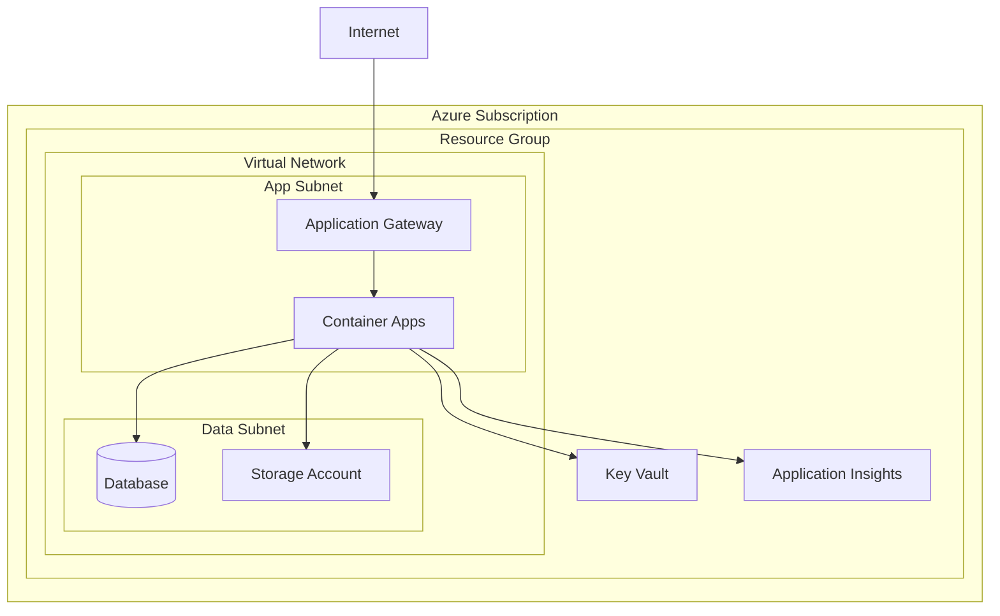

# Generate Infrastructure Documentation

Your goal is to create comprehensive, well-structured documentation for Azure infrastructure, including architecture diagrams, deployment guides, and operational procedures.

## Documentation Types

### Architecture Documentation

**System Architecture**:

- High-level system architecture diagrams
- Infrastructure component relationships
- Data flow and integration patterns
- Network topology and connectivity
- Security architecture and controls

**Infrastructure as Code Documentation**:

- Bicep template structure and organization
- Module dependencies and relationships
- Parameter configuration and environments
- Resource naming conventions and standards
- Deployment procedures and automation

### Operational Documentation

**Deployment Guides**:

- Step-by-step deployment procedures
- Environment-specific configuration guides
- Troubleshooting common deployment issues
- Rollback and recovery procedures
- Infrastructure testing and validation

**Maintenance Procedures**:

- Regular maintenance tasks and schedules
- Monitoring and alerting configurations
- Backup and disaster recovery procedures
- Security patching and updates
- Performance optimization guidelines

## Documentation Structure

### Infrastructure Overview

```markdown
# Infrastructure Documentation

## Architecture Overview

### System Components

- **Compute**: Azure Container Apps, Virtual Machines
- **Storage**: Azure Storage Accounts, Database services
- **Networking**: Virtual Networks, Load Balancers, Application Gateways
- **Security**: Key Vault, Private Endpoints, Network Security Groups
- **Monitoring**: Application Insights, Log Analytics, Azure Monitor

### Environment Structure

- **Development**: Cost-optimized, basic monitoring
- **Staging**: Production-like configuration with reduced scale
- **Production**: High availability, comprehensive monitoring and backup

## Network Architecture

### Virtual Network Design

- **Address Space**: 10.0.0.0/16
- **Subnets**:
  - Application Subnet: 10.0.1.0/24
  - Database Subnet: 10.0.2.0/24
  - Management Subnet: 10.0.3.0/24

### Connectivity

- **Private Endpoints**: Secure connectivity to Azure services
- **Network Security Groups**: Traffic filtering and segmentation
- **Application Gateway**: Load balancing and SSL termination
```

### Bicep Template Documentation

**Module Documentation Template**:

````markdown
# [Module Name] Bicep Module

## Purpose

Brief description of what this module creates and its intended use.

## Parameters

### Required Parameters

| Parameter  | Type   | Description   | Example           |
| ---------- | ------ | ------------- | ----------------- |
| `name`     | string | Resource name | `'myapp-storage'` |
| `location` | string | Azure region  | `'eastus'`        |

### Optional Parameters

| Parameter | Type   | Description | Default          | Example          |
| --------- | ------ | ----------- | ---------------- | ---------------- |
| `sku`     | string | Storage SKU | `'Standard_LRS'` | `'Standard_ZRS'` |

## Outputs

| Output            | Type   | Description              |
| ----------------- | ------ | ------------------------ |
| `resourceId`      | string | Resource identifier      |
| `primaryEndpoint` | string | Primary service endpoint |

## Usage Example

```bicep
module storage 'modules/storage.bicep' = {
  name: 'storageDeployment'
  params: {
    name: storageAccountName
    location: location
    sku: 'Standard_LRS'
  }
}
```
````

## Dependencies

- Virtual Network (for private endpoints)
- Resource Group
- Key Vault (for access keys)

````

### Deployment Documentation

**Deployment Guide Template**:
```markdown
# Deployment Guide

## Prerequisites
- Azure CLI installed and configured
- Appropriate Azure subscription permissions
- Bicep CLI installed
- PowerShell 7+ (for deployment scripts)

## Environment Setup

### Development Environment
```powershell
# Set variables
$resourceGroup = "play14-dev-rg"
$location = "East US"
$environment = "dev"

# Deploy infrastructure
az deployment group create \
  --resource-group $resourceGroup \
  --template-file main.bicep \
  --parameters @parameters/dev.parameters.json
````

### Production Environment

```powershell
# Additional validation for production
az deployment group validate \
  --resource-group $resourceGroup \
  --template-file main.bicep \
  --parameters @parameters/prod.parameters.json

# What-if analysis
az deployment group what-if \
  --resource-group $resourceGroup \
  --template-file main.bicep \
  --parameters @parameters/prod.parameters.json

# Deploy with approval gate
az deployment group create \
  --resource-group $resourceGroup \
  --template-file main.bicep \
  --parameters @parameters/prod.parameters.json \
  --confirm-with-what-if
```

## Post-Deployment Verification

1. Check resource creation status
2. Validate network connectivity
3. Test application endpoints
4. Verify monitoring and alerting
5. Confirm backup configurations

````

## Documentation Generation Process

### Step 1: Infrastructure Analysis

**Template Analysis**:
- Scan all Bicep templates and modules
- Extract parameters, variables, and outputs
- Identify resource dependencies
- Document resource configurations
- Map environment-specific variations

**Resource Inventory**:
```powershell
# Generate resource inventory
az resource list --resource-group $resourceGroup --query "[].{Name:name, Type:type, Location:location}" --output table

# Document resource configurations
az resource show --resource-group $resourceGroup --name $resourceName --resource-type $resourceType
````

### Step 2: Architecture Diagramming

**Mermaid Diagrams for Documentation**:



**Network Topology Documentation**:

- Document subnet configurations and address spaces
- Map network security group rules and traffic flows
- Document private endpoint connections
- Illustrate cross-region connectivity if applicable

### Step 3: Operational Procedures

**Monitoring and Alerting**:

````markdown
## Monitoring Configuration

### Application Insights

- **Application Performance**: Response times, throughput, exceptions
- **Dependency Tracking**: Database and external service calls
- **Custom Metrics**: Business-specific metrics and KPIs

### Azure Monitor Alerts

- **High CPU Usage**: >80% for 10 minutes
- **Memory Pressure**: >85% for 5 minutes
- **Application Errors**: >5% error rate for 5 minutes
- **Database Connection Issues**: Connection failures

### Log Analytics Queries

```kusto
// Application error analysis
AppTraces
| where TimeGenerated > ago(1h)
| where SeverityLevel >= 3
| summarize count() by bin(TimeGenerated, 5m), Message
| render timechart

// Performance trends
AppRequests
| where TimeGenerated > ago(24h)
| summarize avg(DurationMs) by bin(TimeGenerated, 1h)
| render timechart
```
````

**Backup and Recovery**:

```markdown
## Backup Procedures

### Database Backup

- **Automated Backups**: Enabled with 7-day retention
- **Long-term Retention**: Monthly backups kept for 12 months
- **Point-in-time Recovery**: Available for last 7 days

### Application Data Backup

- **Storage Account**: Geo-redundant storage enabled
- **Configuration Backup**: Key Vault secrets and app configurations
- **Infrastructure Backup**: Bicep templates in source control

### Recovery Procedures

1. Assess scope of incident and required recovery point
2. Notify stakeholders and initiate incident response
3. Execute recovery procedures based on scenario
4. Validate recovered systems and data integrity
5. Update monitoring and documentation as needed
```

## Documentation Maintenance

### Regular Updates

**Documentation Review Schedule**:

- **Weekly**: Update deployment logs and operational notes
- **Monthly**: Review and update architecture diagrams
- **Quarterly**: Comprehensive documentation review and updates
- **After Changes**: Update affected documentation immediately

**Version Control**:

- Store documentation in source control with infrastructure code
- Use meaningful commit messages for documentation changes
- Tag documentation versions with infrastructure releases
- Maintain changelog for documentation updates

### Quality Assurance

**Documentation Standards**:

- Use consistent formatting and structure
- Include code examples and practical guidance
- Validate all procedures and scripts
- Ensure diagrams are current and accurate
- Include troubleshooting guidance

**Review Process**:

- Peer review for technical accuracy
- Stakeholder review for completeness
- Regular testing of documented procedures
- Feedback collection and incorporation
- Continuous improvement of documentation quality

Provide your infrastructure templates or deployment details, and I'll generate comprehensive documentation following these standards!
